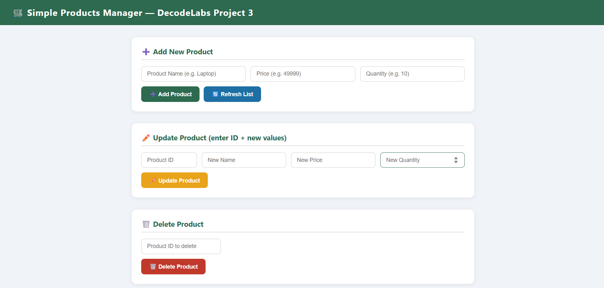
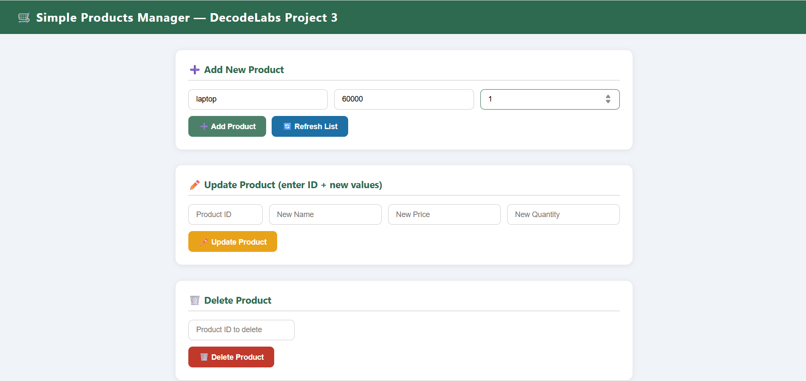
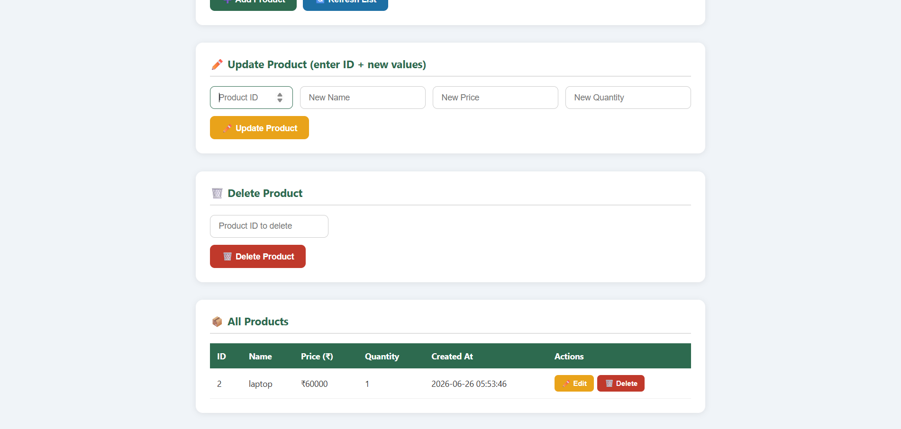
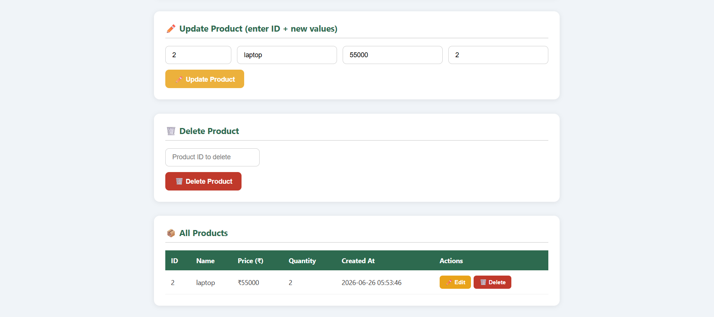

#  Simple Products API

##  Description

A Simple Products REST API built as part of the **DecodeLabs Industrial Training — Project 3 (Database Integration)**. This project demonstrates how to connect a backend server to a real database and perform all four CRUD operations — Create, Read, Update, and Delete — through a clean REST API and an interactive frontend UI.

---

##  Features

This project allows users to add new products with name, price, and quantity. It displays all saved products in a table on the frontend. Users can update any product details directly from the UI. Products can be deleted with a single click. All data is permanently stored in a SQLite database. The API follows RESTful standards with proper HTTP methods. Parameterized queries are used to prevent SQL Injection attacks.

---

##  Technologies Used

The backend is built using Node.js and Express.js to handle all API routes. SQLite is used as the database via the sqlite3 npm package to store product data permanently. The frontend is built with plain HTML, CSS, and JavaScript with no frameworks. Git and GitHub are used for version control and project hosting.

---

##  Screenshots

### 1. Home Page

### 2. Add Product

### 3. Product Added

### 4. Update Product 

### 5. Delete Product

---

## 👨‍💻 Author
K.Santhoshini Mogaveera
